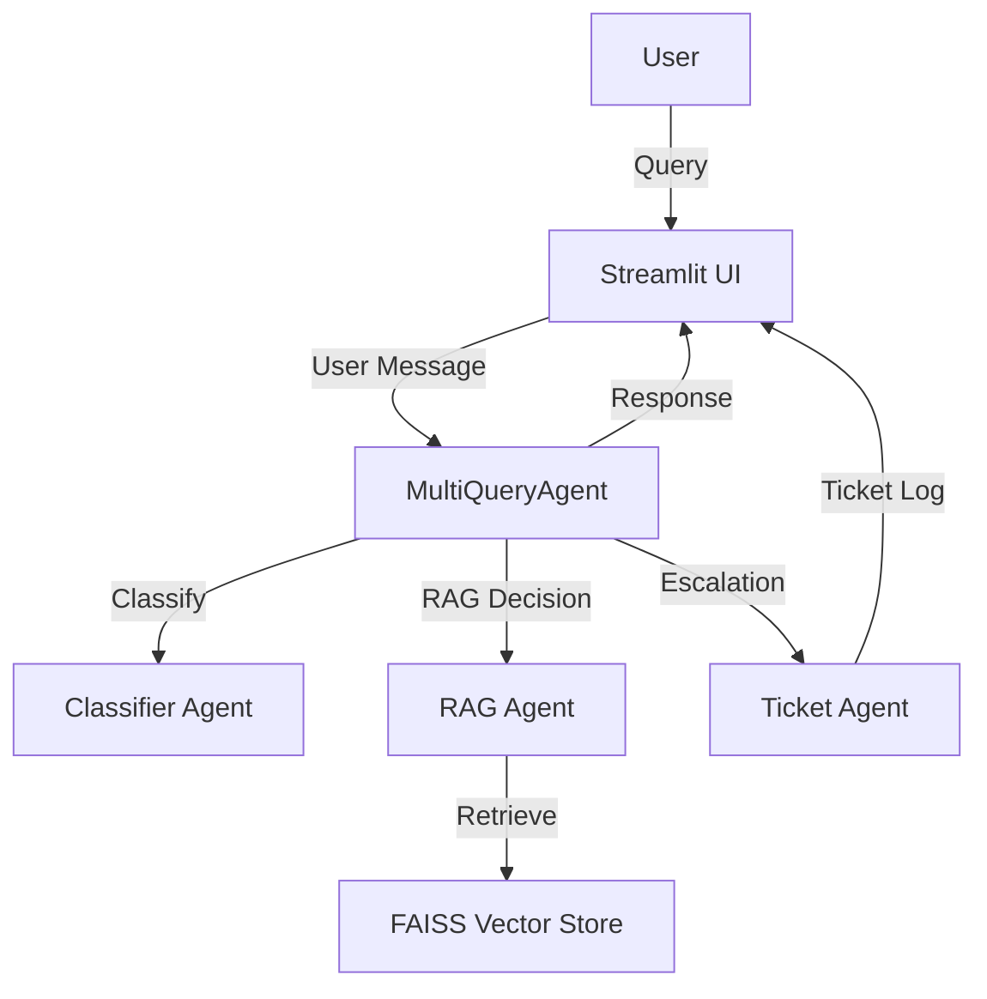
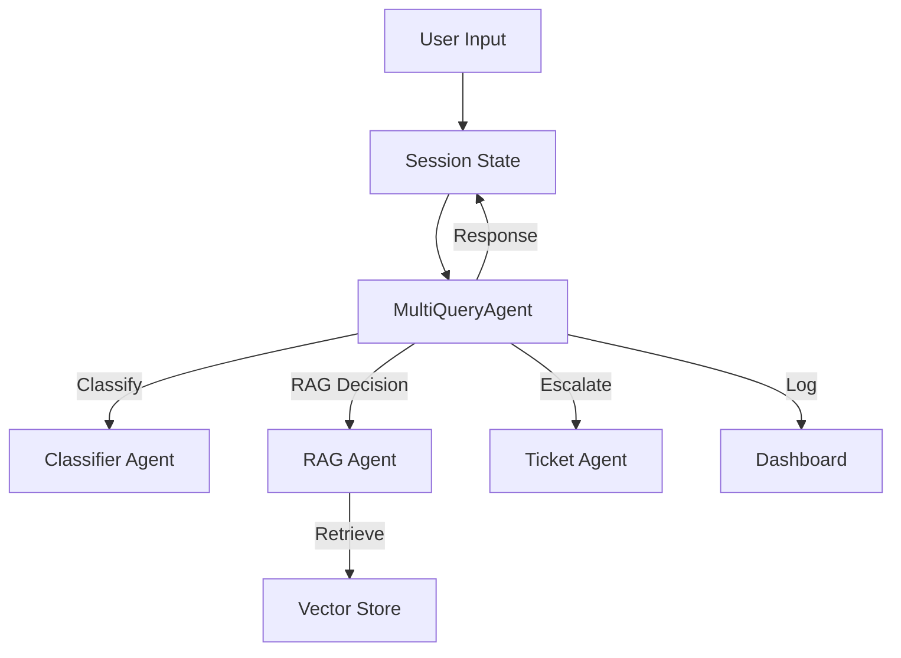
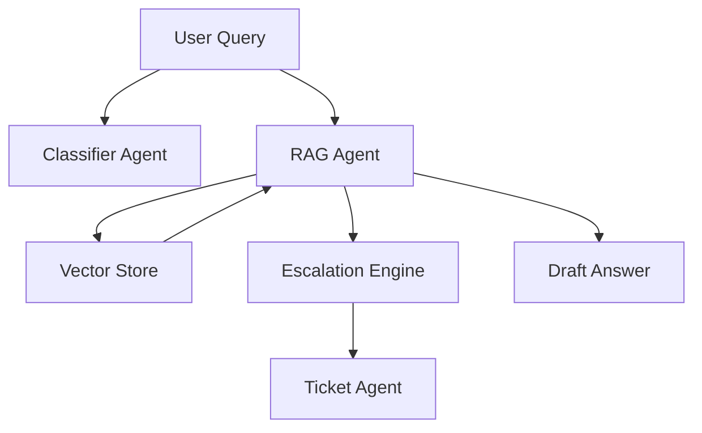

# Customer Support Copilot


## Overview
Customer Support Copilot is an AI-powered Streamlit application designed to assist support teams by automating ticket classification, response generation, and escalation using Retrieval-Augmented Generation (RAG) and LLMs. It features a dashboard for ticket management, a conversational agent, and a robust backend pipeline for knowledge retrieval and ticket escalation.

---

## Table of Contents
- [Features](#features)
- [Architecture](#architecture)
- [System Flowcharts](#system-flowcharts)
- [RAG Pipeline](#rag-pipeline)
- [Directory Structure](#directory-structure)
- [Setup & Installation](#setup--installation)
- [Configuration](#configuration)
- [Usage](#usage)
- [Deployment](#deployment)
- [Security](#security)
- [Contributing](#contributing)
- [License](#license)

---

## Features
- **Conversational AI**: Streamlit UI for real-time support conversations.
- **Ticket Dashboard**: Visualizes ticket status, escalation, and sentiment.
- **Automated Classification**: LLM and local models classify topic, sentiment, and priority.
- **RAG Pipeline**: Retrieves relevant knowledge from vector store for accurate answers.
- **Escalation Engine**: Scores and routes urgent/complex tickets.
- **Extensible**: Modular agent and RAG design for easy customization.

---

## Architecture



- **User** interacts with the Streamlit UI.
- **MultiQueryAgent** orchestrates classification, retrieval, and escalation.
- **Classifier Agent** uses LLM and local models for ticket classification.
- **RAG Agent** retrieves knowledge from the FAISS vector store.
- **Ticket Agent** manages ticket creation and escalation.

---

## System Flowcharts

### 1. Message Handling Flow



### 2. RAG Pipeline



---

## RAG Pipeline
1. **Classification**: User query is classified for topic, sentiment, and priority.
2. **Retrieval**: Top-k relevant documents are retrieved from the FAISS vector store.
3. **Draft Answer**: Retrieved content is synthesized into a draft answer.
4. **Escalation Decision**: Query is scored for escalation based on complexity, sentiment, and topic.
5. **Ticket Creation**: If escalation is needed, a ticket is created and logged.
6. **Final Response**: LLM generates a conversational response using all context.

---

## Directory Structure
```
firstofficer_service/
   customer-support-copilot/
      app.py                # Streamlit UI and main logic
      config.py             # API keys and config
      requirements.txt      # Python dependencies
      agent/
         mquery_agent.py     # Orchestrator agent
         classifier_agent.py # Ticket classification
         rag_agent.py        # RAG pipeline
         ticket_agent.py     # Ticket management
      rag/
         retrieval.py        # Vector store retrieval
         vector_store.py     # Build/update vector store
         data/               # Source docs for vector store
      data/
         sample_tickets.json # Example tickets
      docs/
         architecture_diagram.png
```

---

## Setup & Installation
1. **Clone the repository**
    ```bash
    git clone https://github.com/Swsthik/Auralis-Schema.git
    cd firstofficer_service/customer-support-copilot
    ```
2. **Install dependencies**
    ```bash
    pip install -r requirements.txt
    ```
3. **Prepare .env file**
    - Add your `GOOGLE_API_KEY` and `OPENAI_API_KEY`.

---

## Configuration
- Edit `config.py` and `.env` for API keys and settings.
- Place knowledge base files in `rag/data/secure-agent/` and run `rag/vector_store.py` to build the vector store.

---

## Usage
- Run the app locally:
   ```bash
   streamlit run app.py
   ```
- Interact with the UI, view ticket dashboard, and test the support copilot.

---

## Deployment
- **Docker**: Use the provided `Dockerfile` for containerized deployment.
- **Cloud Run**: Deploy to Google Cloud Run using the documented steps.
- **Hugging Face Spaces**: Deploy for free with the included YAML metadata.

---

## Security
- **API Keys**: Never commit secrets. Use `.env` and environment variables.
- **Data**: Sensitive data is not stored or logged by default.
- **Escalation**: Urgent/critical tickets are flagged and routed for human review.

---

## Contributing
Pull requests and issues are welcome! Please see `CONTRIBUTING.md` for guidelines.

---

## License
MIT License. See `LICENSE` file for details.
